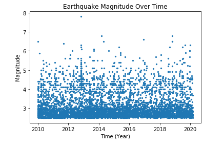
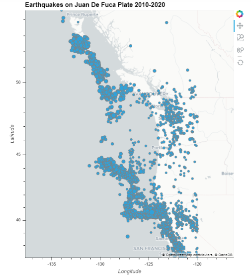
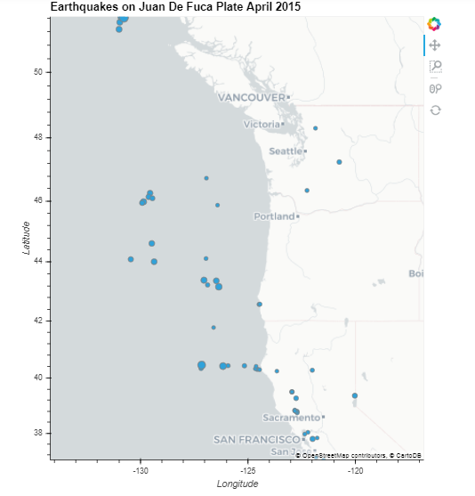
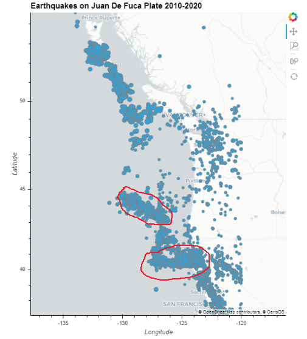
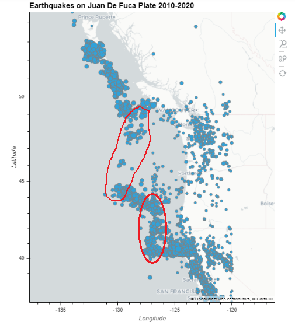
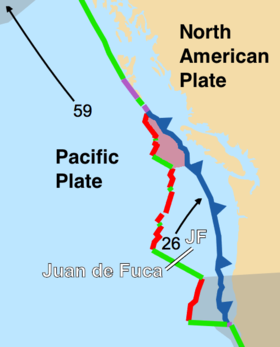

# BME-450-Project-3

Code Link: https://github.com/SamEF99/BME-450-Project-3/blob/master/BME%20450%20Project%20%233.ipynb

# Problem Statement:

For this project, we need to analyze data for earthquake magnitude and location on the boundaries of the Juan De Fuca Plate. We first need to download data from the USGS website for 2.5+ magnitude eathquakes from January 1st 2010 to March 1st 2020, and for only April 2015. We then need to plot earthquake magnitude over time for the ten year period, and the location of earthquakes for both time periods over a map of the area. We also need to adjust the radius of the scatter glyphs in proportion to the magnitude of each earthquake. We then need to analyze this map data in several ways, including finding why April 2015 was significant. We finally need to identify which areas are divergent and transform boundaries, mark them on the map, and explain the trends we see in these areas. 

# The Code: 

The code starts by pulling data from Github for the ten year span CSV. We then append that data to chosen variables, calling to columns in the dataset. We use those variables to plot the earthquake magnitude over time. Next, we use Geoviews to plot the earthquake location over time. We create a set of datapoints from the latitude and longitude data, and plot that over a Carto Light map from the Geoviews tile sources. We also set the size of the scatter glyphs to be dependent on the size of the datapoint, and outline them in grey to distinguish different points. We repeat the same process again for the CSV file from April 2015.

# Results:

# Questions:

Part 1a.) This map shows us the full area of the Juan De Fuca Plate, with all three types of boundaries. Most of the earthquakes are in this area due to the presence of the plate, which is active at all boundaries, and fills a small area. There are nearly no earthquakes inland, in the ocean, or inside the area of the plate, they are solely focused on the plate boundaries.

Part 1b.) We cut off any data below 2.5 magnitude to avoid looking at the numerous tiny tremors in the area. The range of the earthquakes goes as high as about 7.8 magnitude. The average earthquake size is about 2.5-3.0 magnitude, the smaller earthquakes are much more common. There are so many on the magnitude v.s. time plot that individual points can no longer be made out.

Part 1c.) The earthquakes in April 2015 are spread along the west and south sides of the Juan De Fuca plate, mostly the divergent and transform boundaries of the plate. There are several points of relatively high magnitude, pointing to some event that occurred that month. After doing some research, I found that in April 2015,

Part 2a.) The following figure shows a map of the Juan De Fuca Plate. The borders marked in green are transform boundaries, and the ones marked in red are divergent boundaries. Following that, I have marked the major boundaries of each type on our ten year graph of earthquake locations by lining up the maps.

# Conclusion:

# References:
